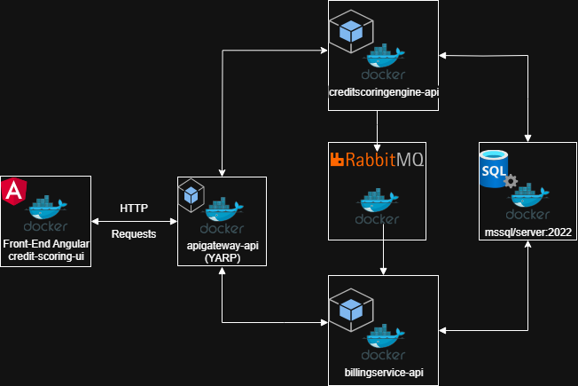

# credit-app-compose

## Sumário

- [Descrição](#descrição)
- [Arquitetura e Tecnologias](#arquitetura-e-tecnologias)
- [Funcionalidades](#funcionalidades)
- [Pré-requisitos](#pré-requisitos)
- [Como rodar](#como-rodar)
- [Documentação da API](#documentação-da-api)
- [Contribuindo](#contribuindo)
- [Licença](#licença)

## Descrição

Este projeto fornece a configuração com Docker Compose para orquestrar uma plataforma de microsserviços voltada para operações de crédito. Ele integra múltiplos serviços, incluindo um API Gateway, uma aplicação front-end Angular e dois serviços de backend: um para análise de crédito e outro para faturamento. Cada serviço é executado em seu próprio container, comunicando-se através de uma rede Docker compartilhada, o que permite um ambiente isolado, escalável e fácil de testar e desenvolver.

## Arquitetura e Tecnologias

- Ambos os backends por facilidade utilizam o mesmo banco de dados Sql Server, porem em databases distintas.

## Funcionalidades
- Gateway reverso baseado em YARP (.NET) apigateway-api
- Aplicação front-end Angular, credit-scoring-ui
-  Backend de análise de crédito (em .NET), creditscoringengine-api
- Serviço de faturamento e controle de faturas (em .NET), billingservice-api

## Pré-requisitos
Antes de executar este projeto, certifique-se de ter os seguintes softwares instalados em sua máquina:
- Docker (versão 20.10 ou superior)
- Docker Compose (incluído nas versões mais recentes do Docker Desktop)
- Git (para clonar os repositórios)
- Docker Desktop instalado na máquina

Você também precisará de acesso aos seguintes repositórios publicos do docker hub
- joaovsmathias/apigateway-api
- joaovsmathias/credit-scoring-ui
- joaovsmathias/billingservice-api
- joaovsmathias/creditscoringengine-api

## Como rodar
Baixar o repositorio:

```bash
$ git clone https://github.com/JoaoSimino/credit-app-compose.git
$ cd credit-app-compose/Docker
$ docker-compose up
```
Apos isso basta acessar no browser a url do front-end
`http://localhost:4200/`

## Documentação da API
- Referente ao projeto [Credit Scoring Engine](https://github.com/JoaoSimino/CreditScoringEngine), contém toda a lógica de análise de crédito e as APIs responsáveis pelo processamento de propostas. Consulte este repositório para entender as regras de negócio e persistência.
- Link do projeto [BillingService](https://github.com/JoaoSimino/BillingService),  responsável pelo controle de faturas, status de pagamento e funcionalidades relacionadas a cobrança.
- Para um entendimento melhor da infra do projeto e como este gateway  esta funcionando como ponto central de entrada para o sistema, roteando as requisições do front-end para os serviços apropriados veja [ApiGateway](https://github.com/JoaoSimino/ApiGateway).
- Repositorio com o front-end [credit-scoring-ui](https://github.com/JoaoSimino/credit-scoring-ui), desenvolvida em Angular, que consome os serviços da plataforma e permite a interação do usuário com o sistema de forma fluida e responsiva.

A interface foi pensada e organizada de forma sequencial e intuitiva. Cada aba representa uma etapa do fluxo de operação:

1- Cadastrar Cliente
- Preencha as informações do cliente.
- Após salvar, o cliente será exibido na próxima aba.

2- Listar Clientes
- Exibe todos os clientes cadastrados.
- Importante: anote o ID do cliente, ele será necessário nas próximas etapas.

3- Solicitar Proposta de Crédito
- Insira o ID do cliente e o valor desejado para solicitar uma proposta.
- A proposta será processada de forma assíncrona por uma tarefa agendada (em até 2 minutos).

4- Verificar Propostas Aprovadas
- Exibe apenas propostas aprovadas.
- Se uma proposta for aprovada, ela terá o status faturaPendente e estará pronta para gerar uma fatura.

5- Selecionar Forma de Pagamento 
- Escolha uma proposta aprovada no primeiro dropdown.
- O sistema de billing calcula automaticamente as opções de parcelamento.
- Selecione a melhor opção e confirme.

6- Verificar Parcelas por Cliente
- Informe o ID do cliente.
- Serão listadas as parcelas geradas, seus valores e status.

Este sistema foi projetado para abstrair a complexidade da arquitetura de microserviços, entregando uma experiência fluida, linear e intuitiva ao usuário.

## Contribuindo

Contribuições são bem-vindas! Para contribuir:

1. Fork este repositório
2. Crie uma branch feature com o padrão `feature/nome-da-feature`
3. Faça commits claros e descritivos
4. Abra um Pull Request detalhando as alterações

Por favor, siga o padrão de commits [Conventional Commits](https://www.conventionalcommits.org/en/v1.0.0/).

## Licença

Este projeto está licenciado sob a licença MIT. Veja o arquivo [LICENSE](LICENSE) para mais detalhes.

---

Obrigado por usar o credit-scoring-ui!  
Para dúvidas ou sugestões, abra uma issue ou entre em contato comigo.


